<div align="center">


# HerbKaya by OnyxIQ

### *Organic Handcrafted Skincare E-commerce Storefront - OnyxIQ Ecosystem*

[](https://nextjs.org/)
[](https://react.dev/)
[](https://www.typescriptlang.org/)
[](https://tailwindcss.com/)
[](https://neon.tech)

**Products you can use. An engineer you can hire.**

*AI automation tools and direct software consulting for founders - built by one engineer, no agency layer.*

</div>

---

> [!IMPORTANT]
> ### 🛡️ Ayurvedic & Medical E-Commerce Solution
> This website is a production-ready e-commerce solution designed for Ayurvedic, herbal, or medical businesses selling products online. While serving as a fully customizable portfolio piece, HerbKaya is also an official client of the OnyxIQ Ecosystem. This system is officially used by HerbKaya, and the official storefront can be visited at [herbkaya.com](https://herbkaya.com). Please note that the official client branding has been removed from this sample deployment for visual alignment, but the code represents the exact high-performance capabilities.
> 
> The underlying software solution and commercial deployment rights are owned by the [OnyxIQ Ecosystem](https://onyxiq.in). This particular demonstration deployment hosted on [herbkaya.onyxiq.in](https://herbkaya.onyxiq.in) is explicitly owned by OnyxIQ and was engineered by [Atul Singh](https://www.linkedin.com/in/atulsingh369/).

---

## 🌌 OnyxIQ Ecosystem Portfolio Integration

**HerbKaya** is integrated into the **OnyxIQ Ecosystem** portfolio. Under OnyxIQ's consulting-first, SaaS-secondary operating model, high-performance applications like HerbKaya are delivered directly to founders, showcasing modular software systems designed for practical production utility.

### Key Portfolio Tenets Demonstrated:
- **Serverless Integration:** Features real-time state management integrated with a serverless database. User profiles, settings, cart controls, and order history are securely persisted in **Neon DB** using `@neondatabase/serverless` and `@neondatabase/auth`, showcasing how a modern stack handles persistent user sessions.
- **Form Follows Function:** Precise geometry based on a strict 8px layout grid, delivering a responsive experience optimized for global performance.
- **Engineered Dark Mode:** Powered by class-based overrides (`html.dark`) toggling clean CSS custom properties. No cluttered utility overrides or Tailwind `dark:` prefix noise.
- **Direct Engineer Ownership:** Handcrafted by a single engineer, representing the OnyxIQ commitment to direct-to-engineer engagement with no project managers or agency markups.

---

## ✨ Features

### 🛍️ Shopping Experience
- **Product Catalogue** - Filterable, sortable product grid with category tags
- **Product Detail** - Rich product pages with ingredient showcases and customer reviews
- **Shopping Cart** - Persistent cart with quantity controls, gift note support, and promo code UI
- **Checkout** - Multi-step checkout (shipping address -> payment method -> order confirmation)
- **Order Tracking** - Real-time-style order tracking page with animated shipping timeline and map view

### 👤 Account Management
- **Authentication** - Secure authentication powered by Neon Auth (`@neondatabase/auth`)
- **Profile** - View and edit personal details and default shipping address, persisted in Neon DB
- **Order History** - Full order list with status badges and per-order tracking, synced to the database
- **Settings** - Sync notification preferences and security settings to the server
- **Dark Mode Toggle** - Toggleable from header, mobile drawer, and account sidebar - persisted across sessions

### 📱 Responsive Design
- **Mobile-first** layout with a premium slide-in drawer navigation
- **Desktop** multi-column navigation bar with inline dark mode toggle
- Consistent design language at all breakpoints (mobile -> tablet -> desktop)

### 🌑 Dark Mode
- **Class-based** dark mode (`html.dark`) powered by CSS custom property overrides
- Seamlessly switches all surfaces, text, borders, and interactive states
- Persisted per user in `localStorage` via `UserContext`

### 🌿 Brand Pages
- **About Us** - Brand story and mission
- **Sustainability** - Environmental commitments and practices

---

## 🖼️ Screenshots

| Light Mode | Dark Mode |
|---|---|
| 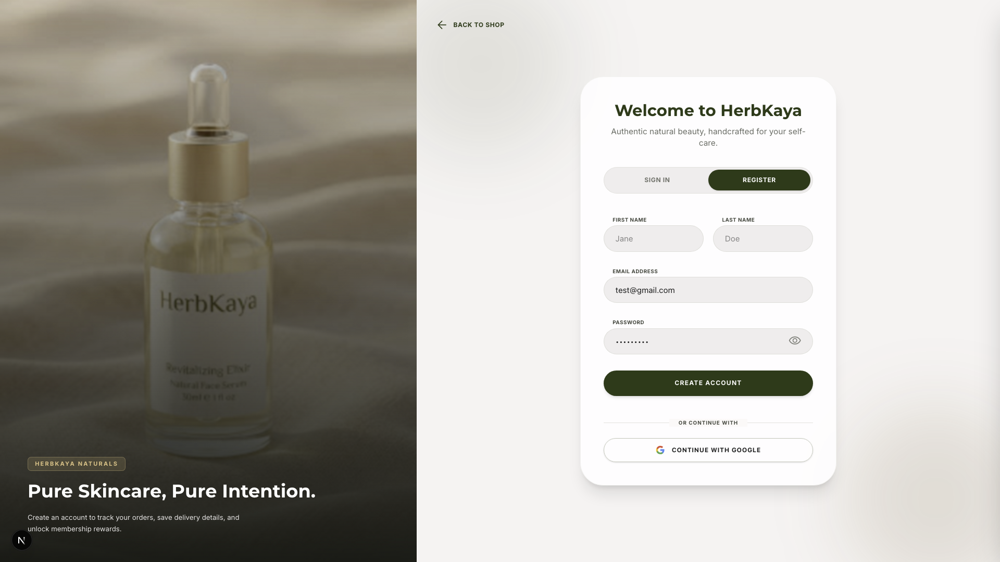 | 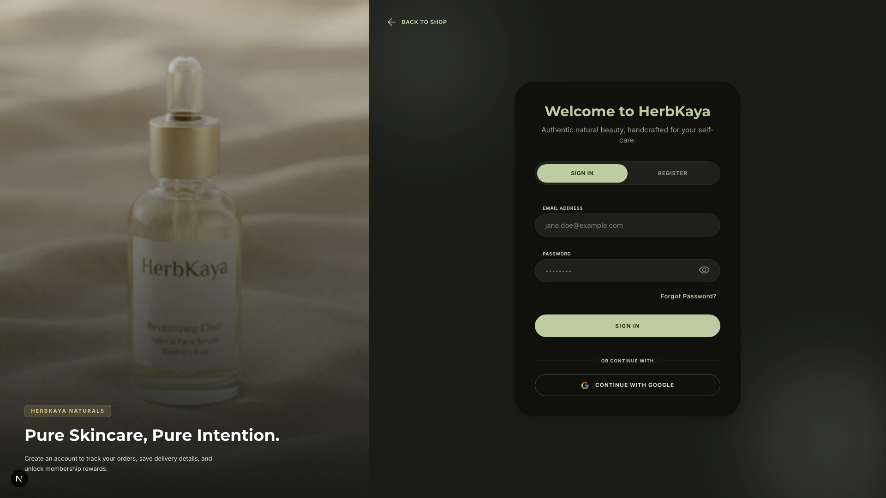 |
| 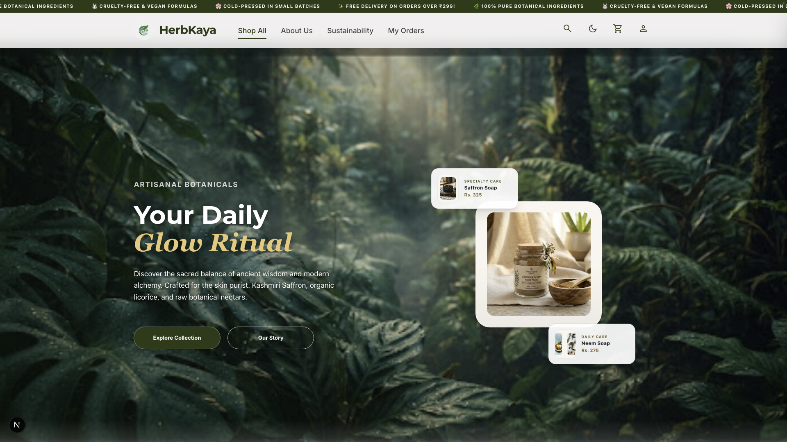 | 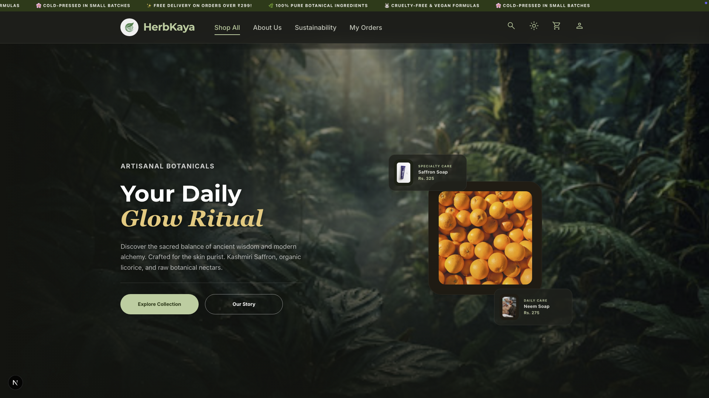 |
| 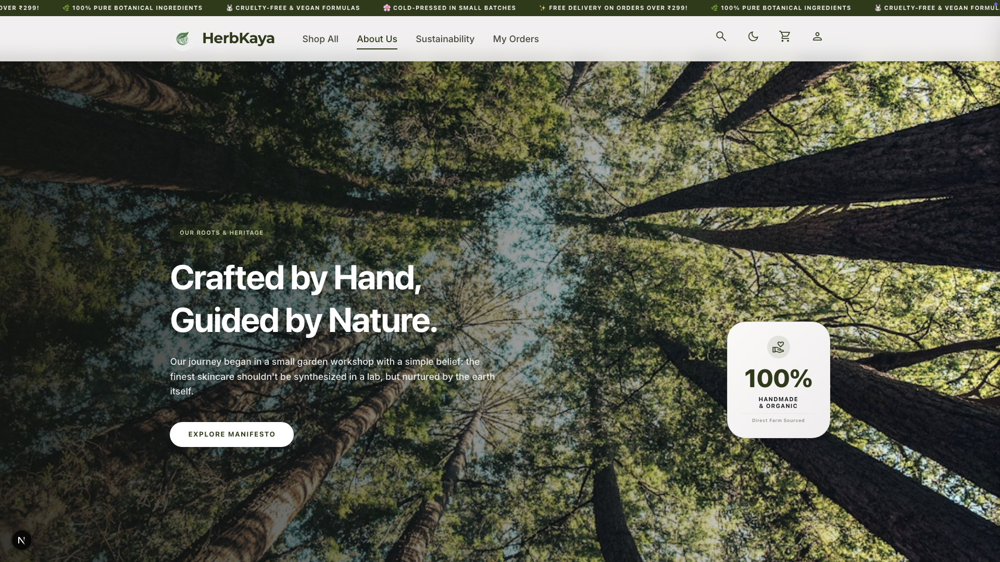 | 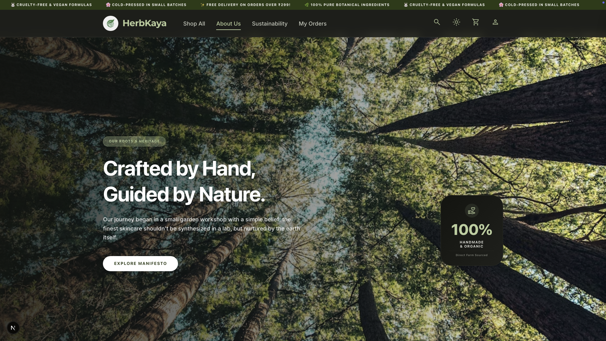 |
| 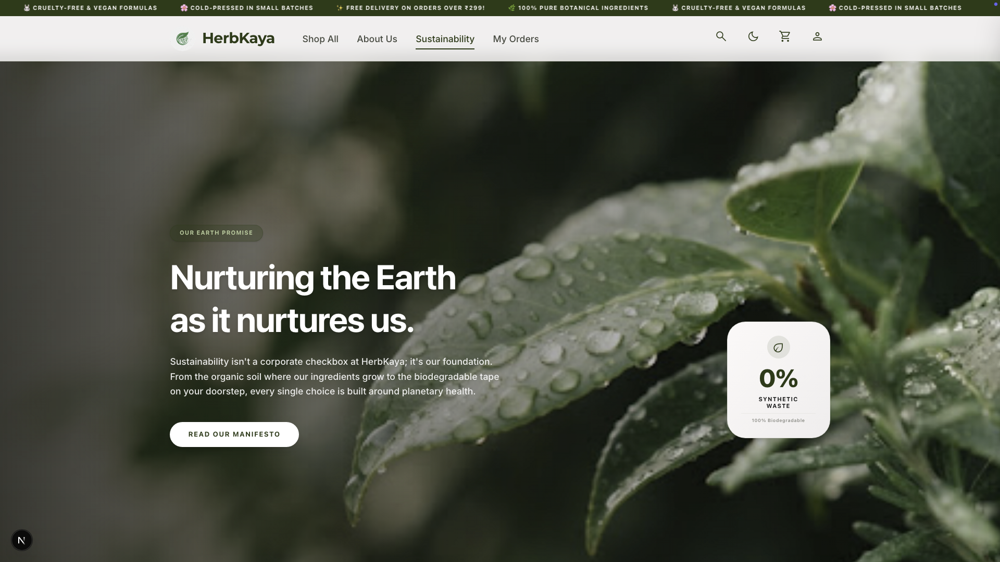 | 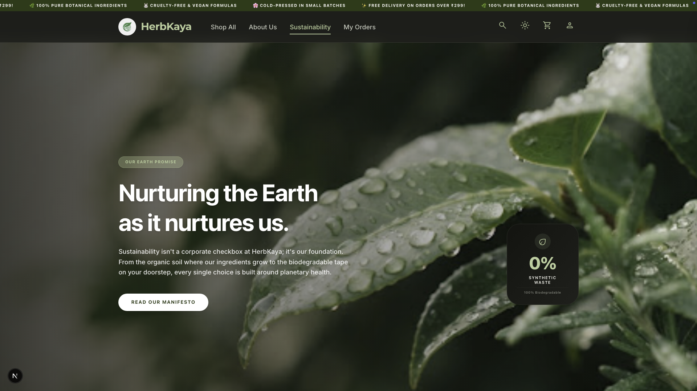 |
| 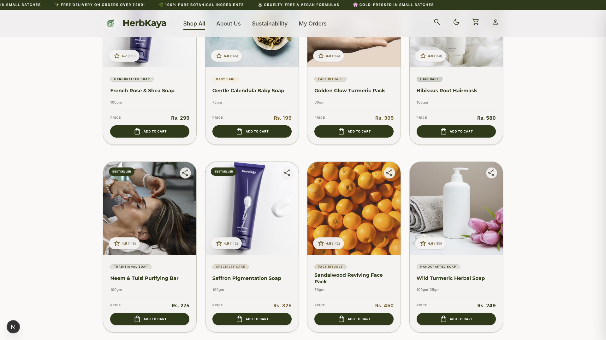 | 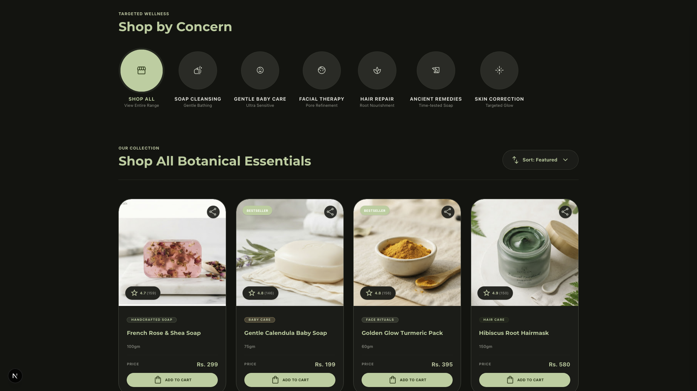 |
| 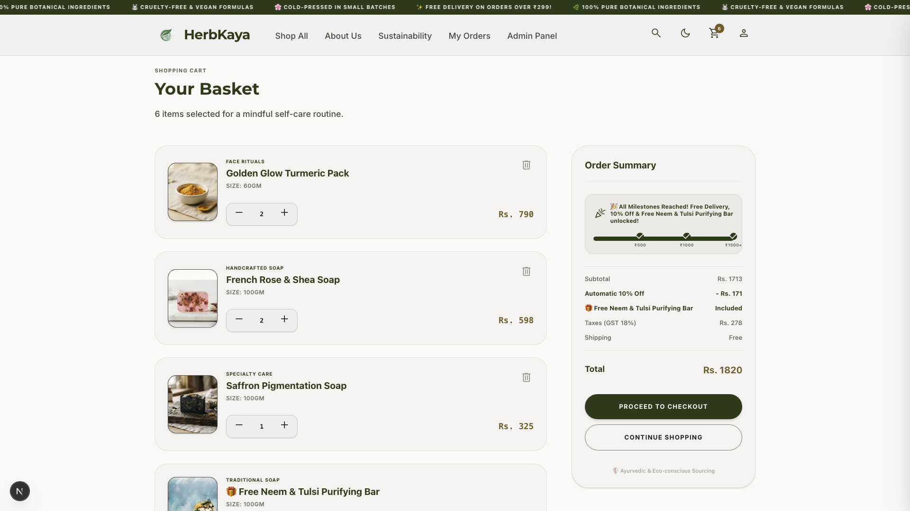 | 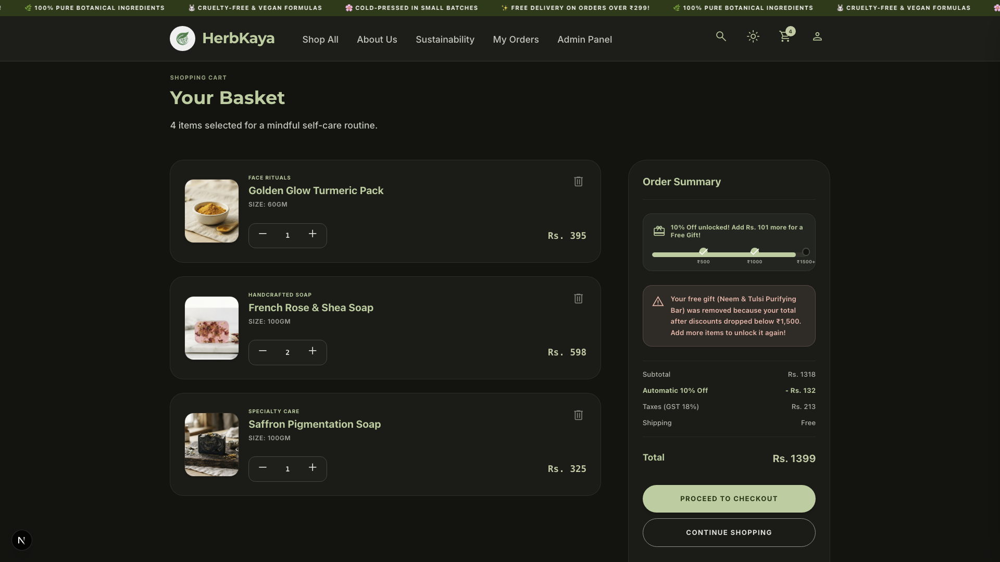 |
| 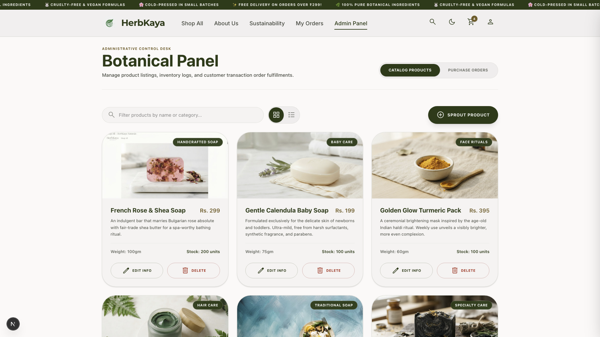 | 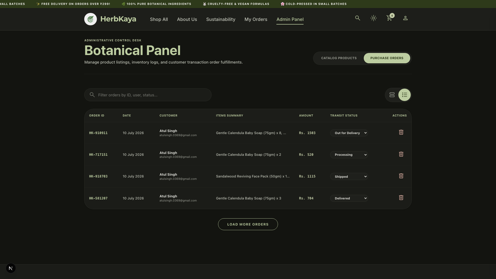 |
| 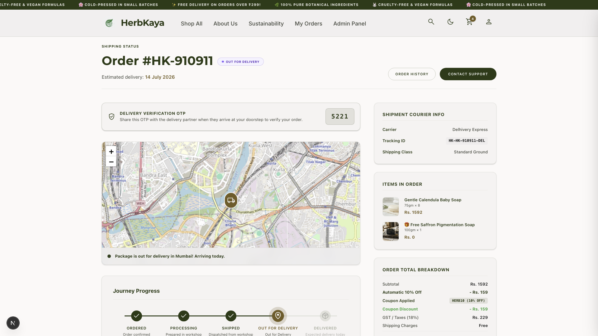 | 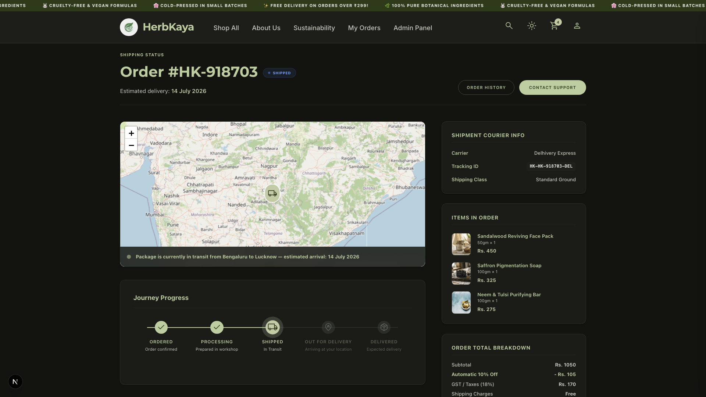 |
| 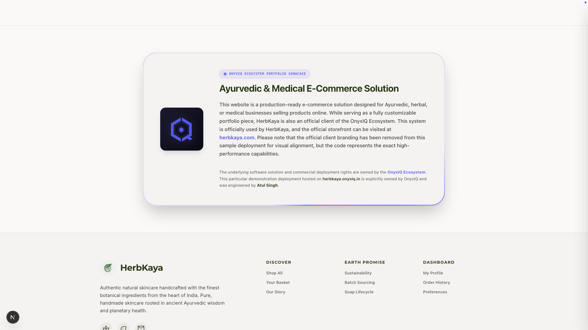 | 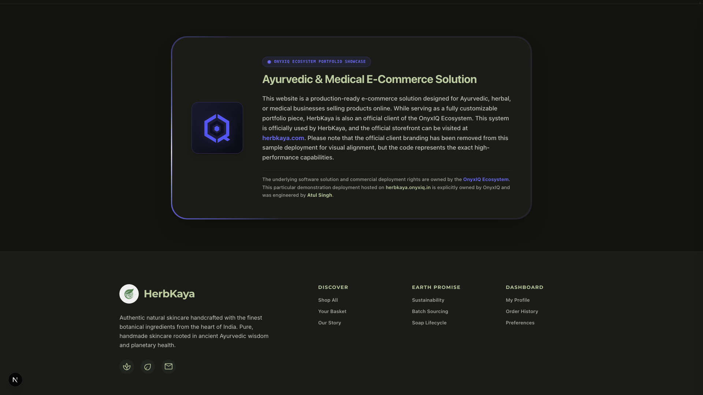 |

> 🌟 **Experience it Live:** Don't just look at pictures — visit [herbkaya.onyxiq.in](https://herbkaya.onyxiq.in) to explore the live, fully interactive Ayurvedic & Medical E-Commerce storefront!

## 🗂️ Pages & Routes

| Route | Description |
|---|---|
| `/` | Home - Hero banner, product grid, brand philosophy, customer reviews |
| `/about` | About Us - Brand story and team |
| `/sustainability` | Sustainability commitments |
| `/product/[id]` | Product detail page |
| `/cart` | Shopping cart |
| `/checkout` | Checkout + order confirmation |
| `/login` | Login / Sign up |
| `/profile` | Account profile view |
| `/profile/edit` | Edit profile & address |
| `/orders` | Order history |
| `/orders/track/[id]` | Order tracking with animated timeline |
| `/settings` | Notification & security settings |

---

## 🛠️ Tech Stack

| Layer | Technology |
|---|---|
| **Framework** | [Next.js 16.2](https://nextjs.org/) - App Router + Turbopack |
| **UI** | [React 19](https://react.dev/) |
| **Language** | [TypeScript 5](https://www.typescriptlang.org/) |
| **Styling** | [Tailwind CSS v4](https://tailwindcss.com/) with CSS custom property theming |
| **Authentication** | [Neon Auth](https://neon.tech/docs/guides/neon-auth) (`@neondatabase/auth`) |
| **Database & Storage** | [Neon Database](https://neon.tech/) serverless PostgreSQL client (`@neondatabase/serverless`) |
| **Icons** | [Google Material Symbols](https://fonts.google.com/icons) (CDN) |
| **Fonts** | Cormorant Garamond (display) · Inter (body) via Google Fonts |
| **State** | React Context + Neon DB persistence (with guest local fallback) |
| **Build** | Turbopack (dev) - Next.js standard build (prod) |

---

## 🚀 Running the Project

If you have authorized access to this repository, you can run the development server locally:

### Prerequisites
- Node.js >= 18.x
- npm >= 9.x

### Setup & Running

```bash
# 1. Install dependencies
npm install

# 2. Start the development server
npm run dev
```

Open [http://localhost:3000](http://localhost:3000) in your browser.

### Available Scripts

```bash
npm run dev      # Start dev server with Turbopack (hot reload)
npm run build    # Production build
npm run start    # Serve production build
npm run lint     # ESLint check
```

---

## 📄 License & Proprietary Rights

This repository is proprietary software. All code, design elements, brand assets, and custom logic are explicitly owned by the **OnyxIQ Ecosystem** and engineered by **Atul Singh**. All rights reserved. 

Unauthorized duplication, modification, distribution, or commercial reuse of this codebase is strictly prohibited.

---

## 📁 Project Structure

```
HerbKaya/
├── public/                     # Static assets (logo, product images)
├── src/
│   ├── app/                    # Next.js App Router pages
│   │   ├── page.tsx            # Home page
│   │   ├── about/              # About Us
│   │   ├── cart/               # Shopping Cart
│   │   ├── checkout/           # Checkout flow
│   │   ├── login/              # Auth
│   │   ├── orders/
│   │   │   ├── page.tsx        # Order history
│   │   │   └── track/[id]/     # Order tracking
│   │   ├── product/[id]/       # Product detail
│   │   ├── profile/            # Account profile + edit
│   │   ├── settings/           # Account settings
│   │   ├── sustainability/     # Sustainability page
│   │   ├── globals.css         # Global styles + Tailwind theme
│   │   └── layout.tsx          # Root layout
│   ├── components/
│   │   ├── Header.tsx          # Navbar + mobile drawer
│   │   ├── Footer.tsx          # Footer
│   │   └── ProductCard.tsx     # Reusable product card
│   ├── context/
│   │   ├── CartContext.tsx     # Cart & order state
│   │   └── UserContext.tsx     # Auth, profile, settings & dark mode
│   └── data/
│       └── products.ts         # Static product catalogue
├── AGENTS.md                   # AI agent coding guidelines
├── CLAUDE.md                   # Claude agent entry point
└── package.json
```

---

## 🎨 Design System

The project uses a **semantic color token system** defined as CSS custom properties:

| Token | Purpose |
|---|---|
| `--color-surface` | Page background |
| `--color-surface-container` | Card / panel background |
| `--color-primary` | Brand green - CTAs, accents, active states |
| `--color-secondary` | Warm gold - prices, highlights |
| `--color-on-surface-variant` | Secondary/muted text |
| `--color-outline-variant` | Borders, dividers |

Dark mode overrides these variables inside the `.dark` selector - no `dark:` Tailwind prefixes needed.

---

## 💾 State & Data Persistence

HerbKaya utilizes **Neon DB** for all authenticated user sessions and data storage:

- **Authentication:** Managed by Neon Auth (`@neondatabase/auth`), enabling secure server-side session management.
- **Cart & Orders:** When logged in, your active shopping cart items, gift notes, and completed orders are synchronized and persisted in **Neon DB**.
- **User Profile & Settings:** Personal profiles, addresses, and interface preferences are stored server-side.
- **Guest Fallback:** Local memory and `localStorage` are used as a fallback for guest checkouts, temporary carts, and local dark mode preferences.
- **Static Catalog:** The product inventory remains static, loaded directly from `src/data/products.ts`.

---

## 🔒 Secrets Management (`dotenvx`)

This repository uses [dotenvx](https://dotenvx.com) to encrypt environment variables in-place. The `.env` file is safely committed to Git because its values are fully encrypted. The private decryption key (`DOTENV_PRIVATE_KEY`) is stored only on the owner's local machine — never in the repository.

### Decrypt for local editing
```bash
npx @dotenvx/dotenvx decrypt
```

### Encrypt after editing (REQUIRED before every git commit)
```bash
npx @dotenvx/dotenvx encrypt
```

> [!IMPORTANT]
> **CRITICAL RULE:** The `.env` file must always be encrypted before committing. Never commit raw credentials.

---

## 🤝 Private Repository & Contributions

This repository is **private** and serves exclusively as a design and engineering showcase for the **OnyxIQ Ecosystem**. Consequently, **contributions are not invited and will not be accepted**. 

Viewers are welcome to explore the codebase to appreciate the application's clean design, semantic styling, and high-performance serverless architecture.

---

<div align="center">

Engineered by [Atul Singh](https://www.linkedin.com/in/atulsingh369/) · Part of the [OnyxIQ Ecosystem](https://onyxiq.in)

</div>
